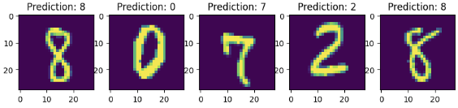

# nanoViT

Jupyter notebook turning PyTorch implementation of nanoGPT [1] into nanoViT (Vision Transformer) to classify MNIST images.

## Environment set up
In your virtual environment install dependencies with
`pip install -r requirements.txt`

## nanoGPT
The first half of the notebook follows [1] par cosmetic refactoring (global consts, class names). Running that you will be able to do text generation, e.g.

```
KING RICHARD III:
What, he hold, sir. Cazils
That he holy shall away, yoE of this strong
Till my fright me one follows...
```
```
FROMIORSY:
Mady lordthus, and so: or for, so aiins a Oxford;
That piteous, and but my hand heavens
Not in little wind so by uncrown
To could to else my sovero husfied.

PAULINA:
TowReard, I say, we not for thy brother;
But, my bad younger r weddital on this not
To gill'st get and thy cannot arm did on...
```

## nanoViT
The second half of the notebook does necessary adjustments [2] to arrive at nanoViT. That is then used to classify MNIST images, e.g.



## References
[1] [Implementing nanoGPT by Andrej Karpathy](https://www.youtube.com/watch?v=kCc8FmEb1nY)

[2] [ViT paper replication by Daniel Bourke](https://www.youtube.com/watch?v=tjpW_BY8y3g)
